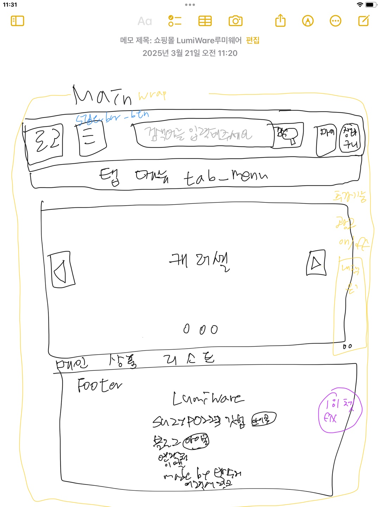
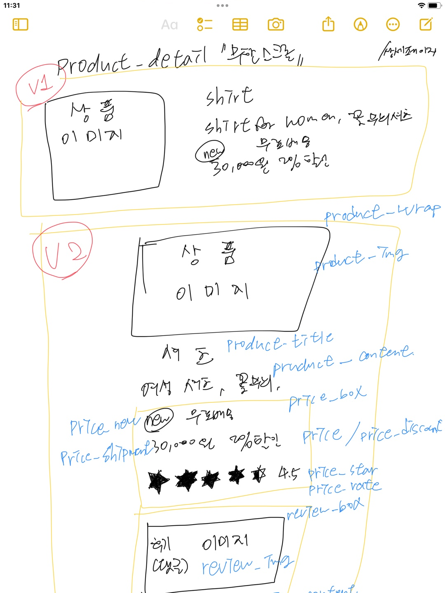
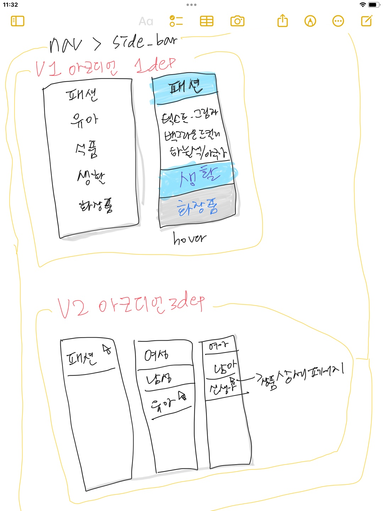
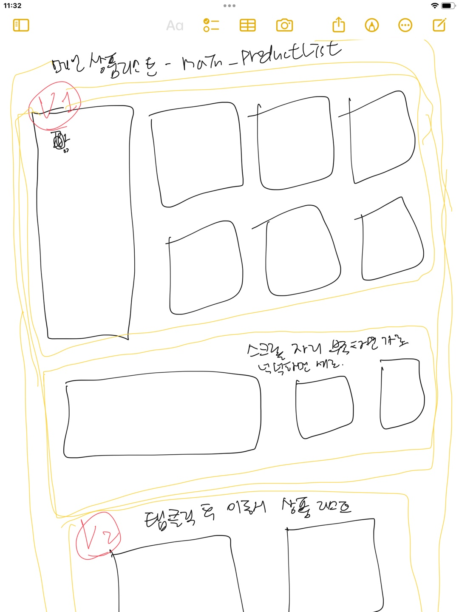
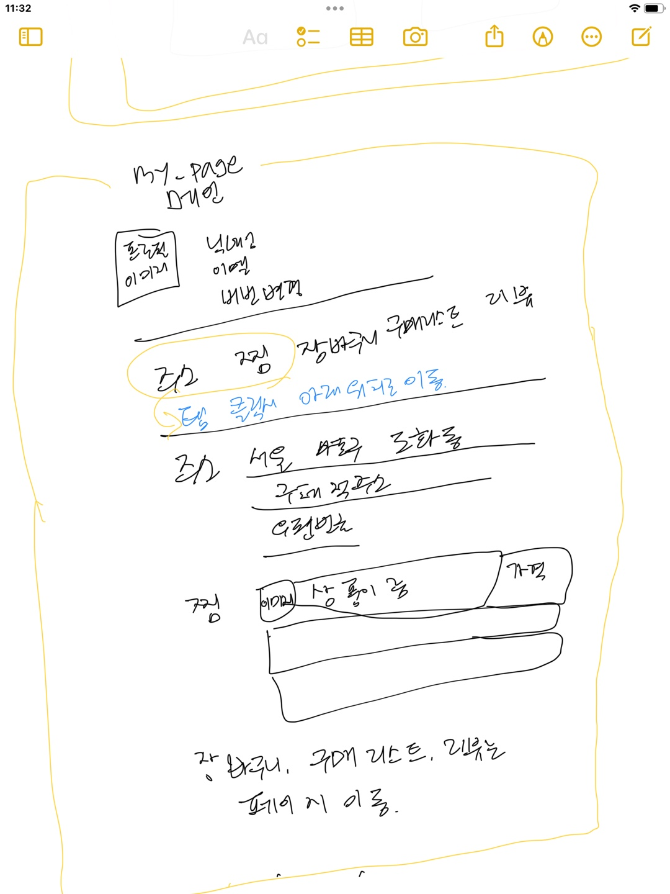
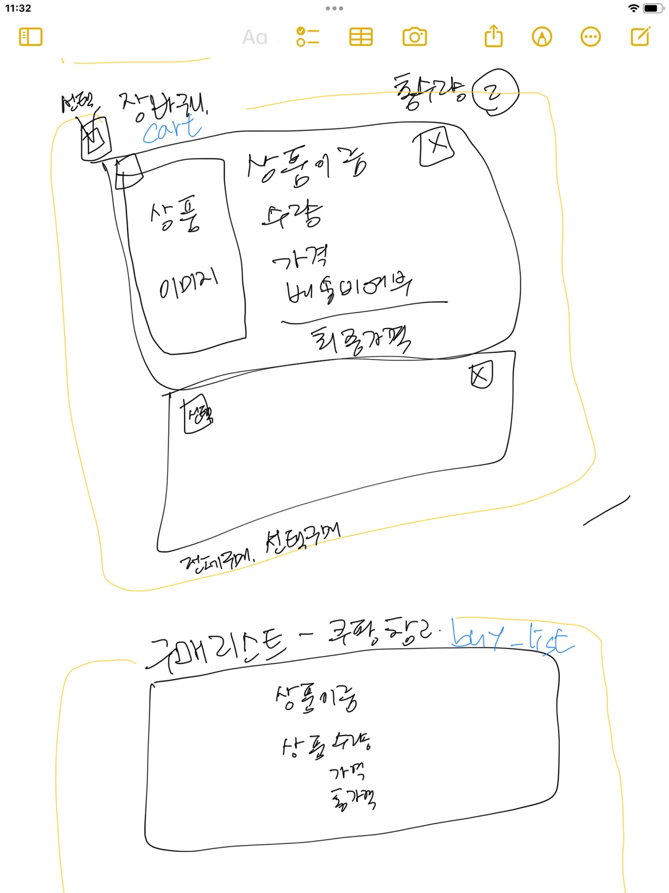
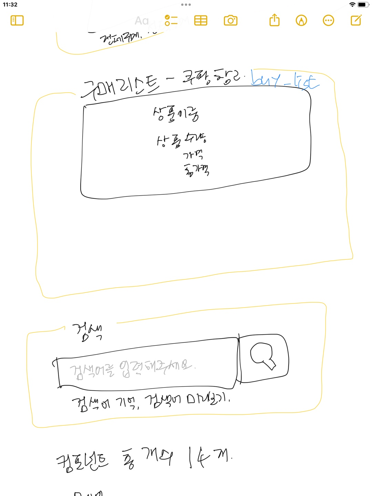

루미웨어 쇼핑몰 컴포넌트 정리

😄 아래에 요청하신 대로 **검토된 항목들**을 정리해서:
1. ✅ 기존 컴포넌트
2. 🔁 이름 보완/수정한 컴포넌트
3. ➕ 추가하면 좋은 컴포넌트
4. 🎨 보완하면 좋은 UI 컴포넌트

**이 네 가지로 정리된 리스트**

---

## 🛒 Rumiware 쇼핑몰 컴포넌트 정리

### ✅ 1. **기본 페이지/기능 컴포넌트**
UI를 담당하는 컴포넌트는 **프리젠터 컴포넌트**라고 하며, 로직을 최소화하고 props를 받아서 UI를 렌더링합니다. 예를 들어, ProductCard.tsx는 상품 정보를 화면에 표시하는 역할 담당.
- `MainPage` (`/`) (메인 페이지)
- `ProductListPage` (상품 리스트)
- `ProductDetailPage`  (상품상세보기)
- `MyPage`  (마이페이지)
- `CartPage`  (장바구니)
- `OrderListPage` (구매 리스트)
- `OrderPaymentPage` (결제)
- `ReviewListPage` (리뷰리스트)
- `ReviewDetailPage`  (리뷰상세보기)

---

### 🔁 2. **이름 수정 및 분리 제안**
| 기존 이름 | 제안 이름 | 설명 |
|-----------|-----------|------|
| `Navbar` | ✅ `TopNavBar` | 상단 네비게이션 바 (로고, 검색창, 유저 메뉴 등) |
| `네비게이션` | ✅ `Sidebar` 또는 `CategoryMenu` | 좌측 상품 카테고리용 사이드 네비게이션 바 |

---

### ➕ 3. **추가하면 좋은 주요 컴포넌트**
| 컴포넌트 이름 | 설명 |
|--------------------|--------|
| `LoginPage`, `SignupPage` | 사용자 인증 화면 |
| `SearchBar` | 상단 검색 기능 |
| `ProductFilter`, `ProductSorter` | 상품 리스트 내 필터/정렬 |
| `ReviewForm` | 리뷰 작성 폼 |
| `ProductOptions` | 색상, 사이즈 등 옵션 선택 |
| `OrderDetailPage` | 구매내역 상세 |
| `AddressForm`, `AddressList` | 결제 시 배송지 입력/선택 |
| `ToastNotification` | 장바구니 추가, 결제 완료 등 알림 |
| `ConfirmModal` | 삭제/구매 확인 등 재사용 가능한 모달
| `StarRating`  | 별점 작성 |

---

### 🎨 4. **보완하면 좋은 UI 공통 컴포넌트**
| 컴포넌트 이름 | 설명 |
|------------------------|--------|
| `LoadingSpinner` | 로딩 상태 표시 |
| `EmptyState` | 장바구니 없음, 주문 없음 등 빈 화면 대응 |
| `ErrorMessage` | API 실패 또는 입력 오류 시 안내 메시지 |
| `Modal` | 공통 모달 컴포넌트 (리뷰 작성, 로그인 등 사용) |

---

## 🧩 구성 예시 구조
```plaintext
src/
├── pages/
│   ├── MainPage.tsx
│   ├── ProductListPage.tsx
│   ├── ProductDetailPage.tsx
│   ├── MyPage.tsx
│   ├── CartPage.tsx
│   ├── OrderListPage.tsx
│   ├── OrderDetailPage.tsx
│   ├── LoginPage.tsx
│   ├── SignupPage.tsx
├── components/
│   ├── layout/
│   │   ├── TopNavBar.tsx
│   │   ├── Sidebar.tsx
│   │   ├── Footer.tsx
│   ├── product/
│   │   ├── ProductCard.tsx
│   │   ├── ProductOptions.tsx
│   ├── review/
│   │   ├── ReviewList.tsx
│   │   ├── ReviewForm.tsx
|   |   ├── StarRating.tsx
│   ├── ui/
│   │   ├── LoadingSpinner.tsx
│   │   ├── EmptyState.tsx
│   │   ├── ToastNotification.tsx
│   │   ├── Modal.tsx
```

---

원하시면 이 구조를 실제 폴더로 생성할 수 있는 **셸 스크립트**나 VSCode 확장 구조로 만들어드릴 수도 있어요!
추가적으로 상태 관리(Recoil, Zustand 등)나 API 연결 구조도 설계해드릴까요? 😄


------------------------------------------------------------------------
이 구조는 **페이지**와 **컴포넌트**를 역할별로 분리하여 관리할 수 있도록 설계한 것.

### 프로젝트 구조

```
src/
├── pages/                             # 각 페이지 컴포넌트
│   ├── MainPage.tsx                   # 메인 페이지
│   ├── ProductListPage.tsx            # 상품 리스트 페이지
│   ├── ProductDetailPage.tsx          # 상품 상세보기 페이지
│   ├── MyPage.tsx                     # 마이페이지
│   ├── CartPage.tsx                   # 장바구니 페이지
│   ├── OrderListPage.tsx              # 구매 리스트 페이지
│   ├── OrderDetailPage.tsx            # 구매내역 상세 페이지
│   ├── LoginPage.tsx                  # 로그인 페이지
│   ├── SignupPage.tsx                 # 회원가입 페이지
├── components/                        # UI 컴포넌트
│   ├── layout/                        # 레이아웃 관련 컴포넌트
│   │   ├── TopNavBar.tsx              # 상단 네비게이션 바
│   │   ├── Sidebar.tsx                # 사이드 네비게이션 바
│   │   ├── Footer.tsx                 # 푸터
│   ├── product/                       # 상품 관련 컴포넌트
│   │   ├── ProductCard.tsx            # 상품 카드
│   │   ├── ProductOptions.tsx         # 상품 옵션 선택
│   ├── review/                        # 리뷰 관련 컴포넌트
│   │   ├── ReviewList.tsx             # 리뷰 목록
│   │   ├── ReviewForm.tsx             # 리뷰 작성 폼
│   │   ├── StarRating.tsx             # 별점 컴포넌트
│   ├── ui/                            # UI 관련 공통 컴포넌트
│   │   ├── LoadingSpinner.tsx         # 로딩 스피너
│   │   ├── EmptyState.tsx             # 빈 상태 표시(장바구니/주문 없음 등 빈 화면)
│   │   ├── ToastNotification.tsx      # 알림(API 실패 또는 입력 오류 시 안내 메시지)
│   │   ├── Modal.tsx                  # 모달(리뷰 작성, 로그인 등 사용)
├── services/                          # API 호출 관련 로직
│   ├── productService.ts              # 상품 관련 API 호출
│   ├── cartService.ts                 # 장바구니 관련 API 호출
│   ├── orderService.ts                # 주문 관련 API 호출
├── state/                             # 상태 관리 (Recoil, Redux 등)
│   ├── cartState.ts                   # 장바구니 상태 관리
│   ├── productState.ts                # 상품 상태 관리
│   ├── userState.ts                   # 사용자 상태 관리
├── hooks/                             # 커스텀 훅
│   ├── useCart.ts                     # 장바구니 관련 커스텀 훅
│   ├── useProducts.ts                 # 상품 관련 커스텀 훅
│   ├── useOrders.ts                   # 주문 관련 커스텀 훅
├── utils/                             # 유틸리티 함수들
│   ├── formatPrice.ts                 # 가격 포맷팅 함수
│   ├── validateEmail.ts               # 이메일 검증 함수
├── App.tsx                            # 앱 진입점 (라우팅 설정 등)
```

### 설명:

- **pages/**: 각 페이지를 담당하는 컴포넌트들이 위치합니다. 예를 들어 `MainPage.tsx`, `ProductListPage.tsx` 등 페이지별로 해당하는 컴포넌트를 배치합니다.

- **components/**: UI 컴포넌트들이 위치합니다. 각 컴포넌트는 기능별로 폴더를 나누어 관리합니다.
  - **layout/**: 레이아웃 관련 컴포넌트들 (상단 네비게이션 바, 사이드바, 푸터 등)
  - **product/**: 상품 관련 컴포넌트들 (상품 카드, 상품 옵션 등)
  - **review/**: 리뷰 관련 컴포넌트들 (리뷰 목록, 리뷰 작성 폼, 별점 컴포넌트 등)
  - **ui/**: 로딩 스피너, 빈 상태 표시, 알림 등 공통 UI 컴포넌트들

- **services/**: API 호출과 비즈니스 로직을 처리하는 서비스들이 위치합니다. 예를 들어 상품 정보, 장바구니, 주문 관련 API 호출 등을 담당합니다.

- **state/**: 상태 관리 관련 파일들입니다. `Recoil`이나 `Redux`를 사용하여 전역 상태를 관리합니다. 예를 들어 장바구니 상태, 상품 상태, 사용자 상태 등을 이곳에서 관리합니다.

- **hooks/**: 커스텀 훅을 정의하여 재사용 가능한 로직을 분리합니다. 예를 들어 장바구니 관련 로직, 상품 목록 로직, 주문 로직 등을 이곳에서 관리합니다.

- **utils/**: 자주 사용하는 유틸리티 함수들을 위치시키는 폴더입니다. 예를 들어 가격 포맷팅, 이메일 검증 함수 등 공통적으로 사용할 수 있는 유틸리티 함수들을 이곳에 배치합니다.

- **App.tsx**: 전체 앱의 진입점이며, 라우팅 설정과 전역 설정을 담당합니다.

이렇게 각 컴포넌트와 로직을 잘 분리하여 관리하면, 유지보수와 확장성이 뛰어난 프로젝트 구조!







